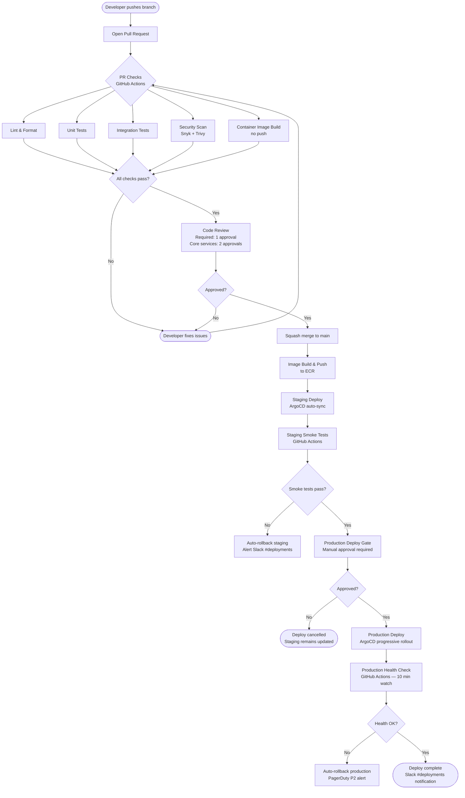

# CI/CD Pipeline — GitHub Actions and ArgoCD

This page documents Luminary's end-to-end delivery pipeline for application services. It covers the branch strategy, every stage of the GitHub Actions PR and merge pipeline, how ArgoCD manages deployments to staging and production, and how to roll back a bad release.

For infrastructure changes (Terraform), there is a separate pipeline documented in the [Terraform Modules](https://placeholder.invalid/page/infrastructure%2Fterraform-modules.md) page. This page covers application service delivery only.

---

## Branch Strategy

Luminary uses **trunk-based development**. All engineers work in short-lived feature branches (max 2 days before merging to `main`) and merge directly to `main` via pull request. There are no long-lived environment branches.

- `main` — the production-ready trunk. Every commit on `main` must be deployable.
- `feat/<ticket-id>-<short-description>` — feature branches, opened as a PR against `main`.
- `fix/<ticket-id>-<short-description>` — bugfix branches.
- `chore/<description>` — for infrastructure, tooling, and non-functional changes.

Release tagging is automated: when a commit on `main` includes `[release]` in its commit message (set by the squash merge title), the pipeline creates a semantic version tag (`v1.2.3`) based on the Conventional Commits specification parsed by `semantic-release`.

Feature flags (managed via LaunchDarkly) decouple deployment from release. Code can be merged to `main` and deployed to production in a disabled state, then enabled incrementally. This is the primary mechanism for managing risk on large features.

---

## Pipeline Overview



---

## Pipeline Stages Detail

### Stage 1: Lint and Format

**Trigger:** Every push to a PR branch. **Runner:** `ubuntu-22.04` (GitHub-hosted). **Average duration:** 1–2 minutes.

Tools run:

- `golangci-lint run` with the `.golangci.yml` config (covers `errcheck`, `govet`, `staticcheck`, `revive`, `gosec`, and 12 other linters).
- `gofmt -l .` — fails if any file needs formatting (enforced; no auto-commit).
- `eslint` + `prettier --check` for the Node.js Billing Service.
- `terraform fmt -check -recursive` for any Terraform files changed in the PR.
- `helm lint charts/<service-name>` for any Helm chart changes.

```yaml
# .github/workflows/pr-checks.yaml (excerpt)
lint:
  runs-on: ubuntu-22.04
  steps:
    - uses: actions/checkout@v4
    - uses: actions/setup-go@v5
      with:
        go-version: '1.22'
        cache: true
    - name: golangci-lint
      uses: golangci/golangci-lint-action@v6
      with:
        version: v1.59.1
        args: --timeout=5m
    - name: Check formatting
      run: |
        if [ -n "$(gofmt -l .)" ]; then
          echo "Files need formatting:"
          gofmt -l .
          exit 1
        fi
```

### Stage 2: Unit Tests

**Trigger:** Every push to a PR branch. **Runner:** `ubuntu-22.04`. **Average duration:** 3–5 minutes.

All Go services: `go test ./... -race -count=1 -coverprofile=coverage.out`. Coverage reports are uploaded to Codecov. PRs that drop overall coverage below 75% or drop coverage on changed files below 80% are blocked (warning only for the 75% floor; hard block for the 80% per-file rule).

Node.js Billing Service: `jest --ci --coverage`.

```yaml
unit-tests:
  runs-on: ubuntu-22.04
  steps:
    - uses: actions/checkout@v4
    - uses: actions/setup-go@v5
      with:
        go-version: '1.22'
        cache: true
    - name: Run tests
      run: go test ./... -race -count=1 -coverprofile=coverage.out -timeout=10m
    - name: Upload coverage
      uses: codecov/codecov-action@v4
      with:
        files: coverage.out
        fail_ci_if_error: true
```

### Stage 3: Integration Tests

**Trigger:** Every push to a PR branch. **Runner:** `ubuntu-22.04` with Docker Compose service containers. **Average duration:** 6–12 minutes.

Integration tests spin up Docker Compose dependencies (PostgreSQL 15, Redis 7, a local Kafka broker via `confluentinc/cp-kafka:7.6`, and a mock Schema Registry) and run the service's integration test suite. Test data is reset between each test using database transactions or truncation.

Key integration test suites:

- **Ingestion Service:** Full ingest path including schema validation, Kafka publish, and backpressure simulation.
- **Query Service:** SQL translation tests against a real ClickHouse instance (Docker image `clickhouse/clickhouse-server:24.3`).
- **Auth Service:** Token issuance and validation, API key lifecycle.
- **Billing Service:** Usage accumulation, Stripe webhook handling (using `stripe-mock`).

### Stage 4: Security Scan

**Trigger:** Every push to a PR branch. **Runner:** `ubuntu-22.04`. **Average duration:** 3–6 minutes.

Two security scanning tools run in parallel:

**Snyk (dependency scan):**

```yaml
- name: Snyk dependency scan
  uses: snyk/actions/golang@master
  env:
    SNYK_TOKEN: ${{ secrets.SNYK_TOKEN }}
  with:
    args: --severity-threshold=high --fail-on=upgradable
```

Snyk scans Go module dependencies and Node.js `package.json` for known CVEs. PRs with HIGH or CRITICAL vulnerabilities that have an available upgrade are blocked. CRITICAL CVEs with no available fix generate a Jira ticket in `PLAT` automatically.

**Trivy (container image scan):** Trivy scans the container image built in Stage 5. It runs after the image is built but before it is pushed. Findings at HIGH or CRITICAL severity block the pipeline.

**Semgrep (SAST):** Semgrep runs on changed Go files using the `p/golang` and `p/secrets` ruleset. It primarily catches hardcoded credentials, SQL injection patterns, and insecure crypto usage. Findings are posted as PR review comments.

### Stage 5: Container Image Build

**Trigger:** Every push to a PR branch (build only, no push). On merge to `main` (build + push to ECR). **Runner:** `ubuntu-22.04`. **Average duration:** 4–8 minutes (layer cache warm), 8–15 minutes (cold).

Images are built using `docker buildx` with BuildKit enabled. Layer caching is stored in GitHub Actions cache (using `type=gha` cache backend), reducing cold build times significantly.

Image tagging convention:

- On PRs: `sha-<short_sha>` (not pushed to ECR).
- On `main` merge: `sha-<full_sha>`, plus `latest` (staging only), plus the semantic version tag if the commit is a release commit.

```yaml
- name: Build and push image
  uses: docker/build-push-action@v5
  with:
    context: .
    push: ${{ github.ref == 'refs/heads/main' }}
    tags: |
      ${{ env.ECR_REGISTRY }}/luminary/${{ env.SERVICE_NAME }}:sha-${{ github.sha }}
      ${{ env.ECR_REGISTRY }}/luminary/${{ env.SERVICE_NAME }}:latest
    cache-from: type=gha
    cache-to: type=gha,mode=max
    build-args: |
      BUILD_SHA=${{ github.sha }}
      BUILD_DATE=${{ steps.date.outputs.date }}
```

All images are signed using **AWS Signer** (sigstore-compatible) after push. The ArgoCD image updater verifies signatures before allowing a new image to be deployed.

---

## Pipeline Stage Summary

| Stage | Trigger | Average Duration | Blocking? | Tool(s) |
| --- | --- | --- | --- | --- |
| Lint & Format | PR push | 1–2 min | Yes | golangci-lint, gofmt, eslint, terraform fmt |
| Unit Tests | PR push | 3–5 min | Yes | go test, jest |
| Integration Tests | PR push | 6–12 min | Yes | go test (Docker Compose) |
| Security Scan | PR push | 3–6 min | Yes (HIGH+) | Snyk, Trivy, Semgrep |
| Image Build (no push) | PR push | 4–15 min | Yes | docker buildx |
| Image Build & Push | main merge | 4–15 min | N/A | docker buildx, ECR |
| Staging Deploy | main merge | ~2 min (ArgoCD sync) | N/A | ArgoCD |
| Staging Smoke Tests | post-staging-deploy | 5–8 min | Yes (auto-rollback) | k6, custom health checks |
| Production Approval | post-smoke-tests | Human-gated | N/A | GitHub Environments |
| Production Deploy | after approval | ~5 min (rollout) | N/A | ArgoCD |
| Production Health Watch | post-deploy | 10 min | Auto-rollback on failure | GitHub Actions + Datadog API |

---

## ArgoCD Configuration

ArgoCD manages all Kubernetes deployments via GitOps. The ArgoCD configuration lives in the `luminary/gitops` repository.

### Application Structure

```
gitops/
├── apps/
│   ├── ingestion-service/
│   │   ├── staging/
│   │   │   └── application.yaml     # ArgoCD Application for staging
│   │   └── production/
│   │       └── application.yaml     # ArgoCD Application for production
│   ├── query-service/
│   ├── auth-service/
│   └── ...
└── infrastructure/
    ├── cert-manager/
    ├── istio/
    ├── karpenter/
    └── datadog/
```

### Staging ArgoCD Application (auto-sync)

```yaml
apiVersion: argoproj.io/v1alpha1
kind: Application
metadata:
  name: ingestion-service-staging
  namespace: argocd
spec:
  project: luminary-staging
  source:
    repoURL: https://github.com/luminary/gitops.git
    targetRevision: main
    path: charts/ingestion-service
    helm:
      valueFiles:
        - values-staging.yaml
  destination:
    server: https://kubernetes.default.svc
    namespace: staging
  syncPolicy:
    automated:
      prune: true
      selfHeal: true
    syncOptions:
      - CreateNamespace=true
      - ServerSideApply=true
    retry:
      limit: 3
      backoff:
        duration: 30s
        factor: 2
        maxDuration: 5m
```

Staging uses `automated.prune: true` and `selfHeal: true` — ArgoCD will automatically sync any drift between the GitOps repo and the cluster state, and prune resources that no longer exist in Git.

### Production ArgoCD Application (manual sync)

Production ArgoCD Applications do **not** use automated sync. They are synced explicitly by the GitHub Actions production deploy job after the approval gate passes:

```yaml
syncPolicy:
  automated: null  # No auto-sync
  syncOptions:
    - CreateNamespace=false
    - ServerSideApply=true
    - RespectIgnoreDifferences=true
```

The GitHub Actions production deploy job syncs the application using the ArgoCD CLI:

```shell
argocd app sync ingestion-service-production \
  --revision "sha-${GITHUB_SHA}" \
  --timeout 300 \
  --prune \
  --wait
```

### Progressive Delivery (Argo Rollouts)

Core application services use [Argo Rollouts](https://argoproj.github.io/rollouts/) instead of standard Kubernetes `Deployment` resources. This enables canary deployments with automatic metric-based promotion or rollback.

Canary strategy for the Query Service (representative):

```yaml
apiVersion: argoproj.io/v1alpha1
kind: Rollout
metadata:
  name: query-service
spec:
  strategy:
    canary:
      canaryService: query-service-canary
      stableService: query-service-stable
      trafficRouting:
        istio:
          virtualService:
            name: query-service-vsvc
      steps:
        - setWeight: 5
        - pause: { duration: 5m }
        - analysis:
            templates:
              - templateName: success-rate
            args:
              - name: service-name
                value: query-service-canary
        - setWeight: 25
        - pause: { duration: 5m }
        - setWeight: 100
      autoPromotionEnabled: false
  minReadySeconds: 30
  revisionHistoryLimit: 5
```

The `success-rate` `AnalysisTemplate` queries Datadog for the canary service's error rate. If the error rate exceeds 1% during the canary phase, the rollout is automatically aborted and the stable version receives 100% of traffic.

---

## Production Deploy Approval Gate

The production approval gate is implemented using **GitHub Environments** with required reviewers.

The `production` GitHub Environment requires:

- Approval from at least **1 member** of the `platform-eng` team.
- A wait timer of **5 minutes** (gives time to review staging smoke test results).
- The approver must **not** be the author of the PR being deployed.

Approval requests are posted automatically to `#deployments` in Slack when staging smoke tests pass, with a link to the pending deployment.

---

## Rollback Procedures

### Automatic Rollback (Production Health Watch)

The production health watch job runs for 10 minutes after a production deploy completes. It polls:

1. The Datadog API for the service's error rate SLO (threshold: > 2% error rate sustained for 2 minutes).
2. The Kubernetes rollout status (via `kubectl rollout status`).
3. The ArgoCD application health status.

If any check fails, the job triggers an automatic rollback:

```shell
# GitHub Actions automatic rollback step
argocd app rollback ingestion-service-production \
  --revision "${PREVIOUS_REVISION}" \
  --timeout 120

# Notify
curl -X POST $SLACK_WEBHOOK \
  -d '{"text":"⚠️ Auto-rollback triggered for ingestion-service to sha-${PREVIOUS_SHA}. Check #incidents."}'
```

A PagerDuty P2 alert is also fired to the `platform-oncall` rotation.

### Manual Rollback

If you need to roll back outside of the automated pipeline (e.g., during an incident after the 10-minute watch window):

**Option A: ArgoCD UI / CLI rollback (fastest)**

```shell
# List recent revisions
argocd app history ingestion-service-production

# Roll back to a specific revision
argocd app rollback ingestion-service-production <REVISION_ID>
```

This reverts the ArgoCD application to a previously deployed Helm chart revision. It does **not** change the Git commit in the GitOps repo.

**Option B: Revert the image tag in GitOps (preferred for sustained rollback)**

```shell
# In the luminary/gitops repository:
git revert <merge-commit-sha>
git push origin main
# ArgoCD picks up the change; production sync is triggered manually as normal
```

**Option C: Argo Rollouts abort (for in-progress canary)**

If the rollout is mid-canary and you need to abort immediately:

```shell
kubectl argo rollouts abort query-service -n production
# This immediately routes 100% traffic back to the stable version
```

### Infrastructure Rollback (Terraform)

Infrastructure rollback (e.g., a bad EKS node group AMI update, an RDS parameter change) follows the [Terraform Modules](https://placeholder.invalid/page/infrastructure%2Fterraform-modules.md) procedure, which involves reverting the Terraform config and applying the previous state.

---

## Secrets Management

Secrets are **never** stored in the GitOps repository. All secrets are managed in **AWS Secrets Manager** and synced into Kubernetes Secrets by the [External Secrets Operator](https://external-secrets.io/).

```yaml
# Example ExternalSecret resource
apiVersion: external-secrets.io/v1beta1
kind: ExternalSecret
metadata:
  name: ingestion-service-secrets
  namespace: production
spec:
  refreshInterval: 5m
  secretStoreRef:
    name: aws-secrets-manager
    kind: ClusterSecretStore
  target:
    name: ingestion-service-secrets
    creationPolicy: Owner
  data:
    - secretKey: KAFKA_SASL_PASSWORD
      remoteRef:
        key: production/ingestion-service/kafka
        property: sasl_password
    - secretKey: SCHEMA_REGISTRY_API_KEY
      remoteRef:
        key: production/ingestion-service/schema-registry
        property: api_key
```

CI/CD secrets used by GitHub Actions (e.g., `SNYK_TOKEN`, `ARGOCD_AUTH_TOKEN`, `AWS_DEPLOY_ROLE_ARN`) are stored as GitHub Organisation Secrets and are accessible only to workflows in repositories within the `luminary` GitHub organisation.

---

## Related Pages

- [Kubernetes Cluster Setup](https://placeholder.invalid/page/infrastructure%2Fkubernetes-cluster-setup.md) — The cluster services are deployed to
- [Terraform Modules](https://placeholder.invalid/page/infrastructure%2Fterraform-modules.md) — Infrastructure provisioning pipeline
- [Architecture — System Overview](System-Architecture-—-Deep-Dive.md)
- [Deployment Runbook](https://placeholder.invalid/page/operations%2Fdeployment-runbook.md)
