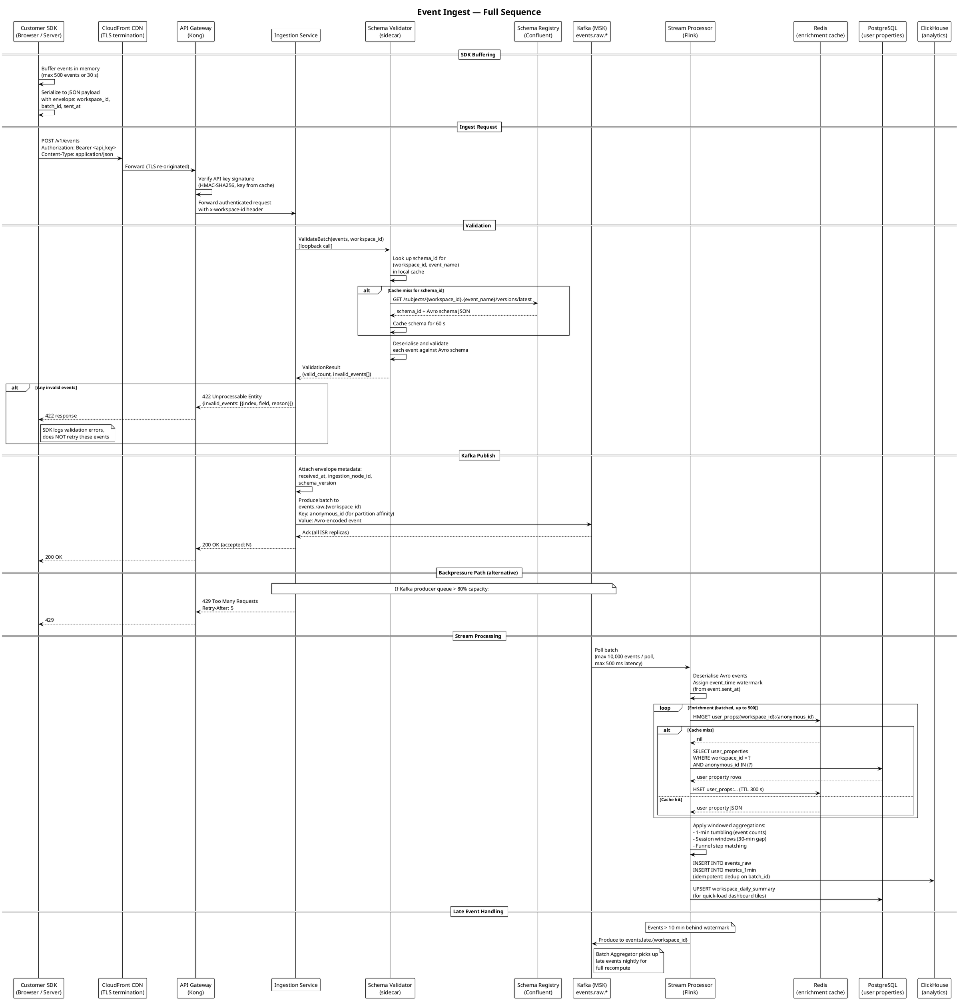

# Data Flow — Event Ingestion to Storage

This page documents the complete journey of an event from the moment a customer's application calls the Luminary SDK through to the event being queryable in the analytics dashboard. Understanding this flow is essential for debugging latency issues, schema problems, and data discrepancies.

For the services involved in this flow, see the [System Overview](https://placeholder.invalid/page/architecture%2Fsystem-overview.md). For the schema versioning strategy that governs event structure, see [ADR-002](ADR-002-Event-Schema-Versioning-with-Avro-and-Schema-Registry.md).

---

## Overview

At the highest level, data flows through four logical stages:

1. **Capture** — The SDK buffers and batches events client-side, then sends them over HTTPS to the Ingestion Service.
2. **Validate & Enqueue** — The Ingestion Service authenticates the request, validates each event against its Avro schema, and publishes valid events to a Kafka topic.
3. **Process** — The Stream Processor (Flink) consumes from Kafka, enriches and aggregates events, and writes results to ClickHouse and PostgreSQL.
4. **Serve** — The Query Service reads from ClickHouse (for ad-hoc and windowed metrics) and from PostgreSQL (for pre-computed workspace-level summaries).

End-to-end latency target (event emission to queryable in dashboard): **p50 < 10 s, p99 < 30 s**.

---

## Detailed Ingest Sequence

The diagram below shows the full synchronous and asynchronous path for a single event batch from a customer SDK.



---

## SDK Batching Behaviour

The Luminary JS SDK (and server-side SDKs in Go, Python, Ruby) buffer events locally before sending. The buffer flush triggers when either:

- 500 events have accumulated, or
- 30 seconds have elapsed since the last flush, or
- The user navigates away from the page (JS SDK uses `sendBeacon` for the final flush).

Events are serialised into a JSON envelope before sending. The envelope format is:

```json
{
  "workspace_id": "ws_01HX2K9P8Q3RNVT7Z",
  "batch_id": "batch_01HX2KB3MQ7WNPZ5A",
  "sent_at": "2025-11-14T13:42:07.883Z",
  "events": [
    {
      "event_id": "evt_01HX2KB4P9QRNVT8Y",
      "event_name": "page_viewed",
      "anonymous_id": "anon_8a3f2c1d",
      "user_id": "usr_4f9e1a2b",
      "timestamp": "2025-11-14T13:42:05.112Z",
      "properties": {
        "path": "/dashboard",
        "referrer": "https://google.com",
        "screen_width": 1920
      },
      "context": {
        "ip": "203.0.113.42",
        "user_agent": "Mozilla/5.0 ...",
        "library": { "name": "luminary-js", "version": "3.2.1" }
      }
    }
  ]
}
```

The `batch_id` is used by the Ingestion Service as the idempotency key for the Kafka produce call. Duplicate batch submissions (e.g., from SDK retries) are deduplicated at the Kafka producer level using the transactional ID `{workspace_id}:{batch_id}`.

---

## Kafka Topics

All event topics use Avro encoding with the schema ID embedded in the message header (Confluent wire format). Topics are partitioned by `anonymous_id` to ensure events from the same user land in the same partition, preserving order for session window computation in Flink.

| Topic | Partitions | Replication Factor | Retention | Key | Value Schema | Consumer Groups |
| --- | --- | --- | --- | --- | --- | --- |
| `events.raw.{workspace_id}` | 12 | 3 | 7 days | `anonymous_id` | `LuminaryEvent` v2+ | `flink-stream-processor`, `batch-aggregator-cold` |
| `events.billing.usage` | 6 | 3 | 3 days | `workspace_id` | `UsageIncrement` v1 | `billing-service` |
| `events.late.{workspace_id}` | 6 | 3 | 30 days | `anonymous_id` | `LuminaryEvent` v2+ | `batch-aggregator-late` |
| `events.dlq` | 3 | 3 | 90 days | `workspace_id` | `DeadLetterEvent` v1 | `platform-eng-alerts` |
| `schema.changes` | 3 | 3 | indefinite (compact) | `subject` | `SchemaChangeEvent` v1 | `flink-stream-processor` (schema refresh) |

### Per-Workspace Topic Provisioning

`events.raw.{workspace_id}` topics are provisioned automatically when a new workspace is created. The Billing Service publishes a `workspace.created` event to a Kafka admin topic; a dedicated Topic Provisioner service (a small Go binary) receives this and calls the MSK AdminClient to create the topic with the standard config.

Topics for deactivated workspaces are not deleted immediately — they are marked for deletion after 90 days to allow data recovery. Topic deletion is permanent and irreversible.

### Kafka Consumer Group Lag Monitoring

Consumer group lag on `events.raw.*` is the primary SLI for the stream processing path. Alerts fire when:

- Flink consumer group lag exceeds **500,000 events** across all partitions (P2 — processing is falling behind).
- Flink consumer group lag exceeds **2,000,000 events** (P1 — significant data freshness degradation).

Lag is exported to Datadog via the Kafka exporter DaemonSet and visualised on the "Data Pipeline Health" dashboard.

---

## ClickHouse Data Model

### `events_raw` table

Stores every individual validated event. Used for ad-hoc exploration, per-event debugging, and as the base for funnel queries.

```sql
CREATE TABLE events_raw ON CLUSTER luminary_cluster
(
    workspace_id     LowCardinality(String),
    event_id         String,
    event_name       LowCardinality(String),
    anonymous_id     String,
    user_id          Nullable(String),
    timestamp        DateTime64(3, 'UTC'),
    received_at      DateTime64(3, 'UTC'),
    properties       String,          -- JSON blob
    user_properties  String,          -- JSON blob, enriched at ingest time
    schema_version   UInt16,
    batch_id         String,
    _partition_date  Date MATERIALIZED toDate(timestamp)
)
ENGINE = ReplicatedMergeTree('/clickhouse/tables/{shard}/events_raw', '{replica}')
PARTITION BY (workspace_id, _partition_date)
ORDER BY (workspace_id, event_name, timestamp, event_id)
TTL _partition_date + INTERVAL 90 DAY
SETTINGS index_granularity = 8192;
```

The `properties` and `user_properties` fields are stored as raw JSON strings. ClickHouse's `JSON` extraction functions (`JSONExtractString`, `JSONExtractInt`) are used in queries. This was a deliberate choice over typed columns — see the discussion in [ADR-002](ADR-002-Event-Schema-Versioning-with-Avro-and-Schema-Registry.md#consequences) for the reasoning.

### `metrics_1min` table

Pre-aggregated 1-minute tumbling window counts, produced by the Flink stream processor. This is what the dashboard reads for real-time metric tiles.

```sql
CREATE TABLE metrics_1min ON CLUSTER luminary_cluster
(
    workspace_id  LowCardinality(String),
    event_name    LowCardinality(String),
    window_start  DateTime('UTC'),
    event_count   UInt64,
    unique_users  UInt64,      -- HyperLogLog approximation
    _updated_at   DateTime64(3, 'UTC')
)
ENGINE = ReplicatedReplacingMergeTree('/clickhouse/tables/{shard}/metrics_1min', '{replica}', _updated_at)
PARTITION BY toYYYYMM(window_start)
ORDER BY (workspace_id, event_name, window_start);
```

`ReplacingMergeTree` is used here so that Flink's exactly-once reprocessing during Batch Aggregator runs can safely overwrite rows by writing a newer `_updated_at`.

---

## Data Retention and Purge

| Data Store | Dataset | Retention | Purge Mechanism |
| --- | --- | --- | --- |
| Kafka | `events.raw.*` | 7 days | Kafka time-based retention |
| Kafka | `events.late.*` | 30 days | Kafka time-based retention |
| Kafka | `events.dlq` | 90 days | Kafka time-based retention |
| S3 | Raw event archive | 2 years | S3 Lifecycle: transition to Glacier after 90 days, delete after 2 years |
| ClickHouse | `events_raw` | 90 days per workspace | ClickHouse TTL expression |
| ClickHouse | `metrics_1min` | 2 years | ClickHouse TTL expression |
| PostgreSQL | `workspace_daily_summary` | 2 years | Scheduled DELETE job |
| Redis | Query cache | 5 min – 24 h | TTL per cache key |

Customer-requested data deletion (GDPR erasure) follows a separate procedure documented in [Data Privacy and GDPR](https://placeholder.invalid/page/..%2FSD%2Fprocesses%2Fdata-privacy-and-gdpr.md).

---

## Late Arrival and Reprocessing

Events that arrive with a `timestamp` more than 10 minutes behind the current Flink watermark are considered "late." The Flink job does not drop them — it routes them to `events.late.{workspace_id}` for deferred processing.

The Batch Aggregator (Spark on EMR Serverless) runs nightly at 02:00 UTC and:

1. Reads the previous 7 days of raw events from `events.raw.*` (or S3 archive for older data).
2. Recomputes all aggregations for the affected time windows.
3. Writes corrected rows to ClickHouse using the `ReplacingMergeTree` engine's idempotent upsert semantics.

This means dashboard data for any given time window is "final" after the next nightly batch run. Users may see slightly different numbers between real-time (Flink-computed) and historical (batch-corrected) views for the most recent 24 hours. A UI indicator in the dashboard ("Last recomputed: N hours ago") communicates this to users.

---

## Schema Evolution

Event schemas are managed via Avro and the Confluent Schema Registry. See [ADR-002: Event Schema Versioning](ADR-002-Event-Schema-Versioning-with-Avro-and-Schema-Registry.md) for the decision rationale and compatibility rules.

In summary:

- Schema changes must be backward-compatible (new optional fields only) unless a major version migration is planned.
- The Schema Validator sidecar enforces the registered schema for each workspace's event stream.
- Flink handles schema version skew by carrying both the event's `schema_version` and the registered field list; it uses the latest schema to project missing fields as `null`.

---

## Observability

Key metrics and their Datadog dashboard locations:

| Metric | Type | Alert Threshold | Dashboard |
| --- | --- | --- | --- |
| `ingestion.events.accepted_per_sec` | Counter | — | Data Pipeline Health |
| `ingestion.events.rejected_per_sec` | Counter | > 100/s (P3) | Data Pipeline Health |
| `ingestion.http.p99_latency_ms` | Gauge | > 200 ms (P2) | Ingestion SLO |
| `kafka.consumer_group.lag` | Gauge | > 500K (P2), > 2M (P1) | Data Pipeline Health |
| `flink.checkpoint.duration_ms` | Gauge | > 30,000 ms (P2) | Flink Health |
| `clickhouse.insert.rows_per_sec` | Counter | < 1,000/s sustained (P2) | ClickHouse Health |
| `query.p95_latency_ms` | Gauge | > 5,000 ms (P2) | Query SLO |
