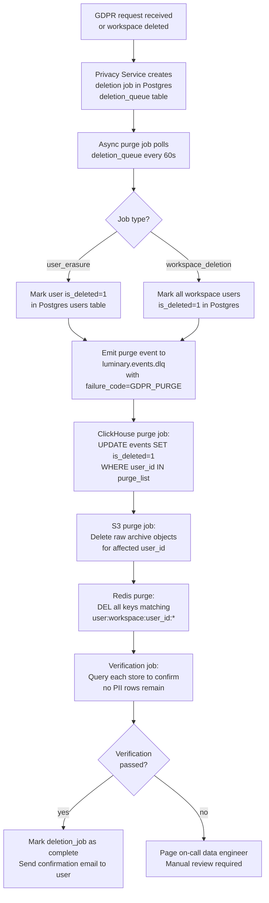

# Data Retention and Purging

This document covers Luminary's data retention policies and the technical implementation of the purge pipeline used to honor GDPR Right to Erasure requests, workspace deletions, and standard data lifecycle expiry.

---

## Retention Policy by Data Type

| Data Type | Store | Default Retention | Enterprise Retention | Deletion Trigger |
| --- | --- | --- | --- | --- |
| Raw events | ClickHouse `events` | 24 months | Up to 60 months (contracted) | TTL clause / GDPR purge job |
| Session records | ClickHouse `sessions` | 24 months | Up to 60 months | TTL clause / GDPR purge job |
| Funnel aggregates | ClickHouse `funnels_aggregated` | 24 months | Up to 60 months | TTL clause |
| Raw event archive | S3 `luminary-events-archive` | 24 months | Up to 60 months | S3 lifecycle rule |
| User profiles | Postgres `users` | Retained until workspace deletion | Same | Workspace delete job |
| Audit logs | Postgres `audit_events` | 7 years | Same | Scheduled purge job |
| Billing records | Postgres `billing_records` | 7 years (legal requirement) | Same | Not purgeable by GDPR |
| Session tokens | Redis | 24 hours (TTL on key) | Same | Redis key expiry |
| Webhook delivery logs | Postgres `webhook_deliveries` | 90 days | Same | Scheduled purge job |
| Export files | S3 `luminary-exports` | 7 days after creation | Same | S3 lifecycle rule |
| ClickHouse query cache | Redis | 5 minutes (TTL on key) | Same | Redis key expiry |

Note: Billing records are retained for 7 years regardless of GDPR deletion requests. Under GDPR Article 17(3)(b), financial records must be retained for legal compliance. The user's personally identifiable information within billing records (name, email) is anonymized, but the financial transaction data remains.

---

## GDPR Deletion Flow

When a user submits a Right to Erasure request, or when a workspace is deleted, the following process is triggered:



### Deletion Queue Schema (Postgres)

```sql
CREATE TABLE deletion_queue (
    id              UUID PRIMARY KEY DEFAULT gen_random_uuid(),
    job_type        TEXT NOT NULL CHECK (job_type IN ('user_erasure', 'workspace_deletion')),
    workspace_id    UUID NOT NULL,
    user_id         UUID,              -- NULL for workspace_deletion
    requested_by    UUID NOT NULL,     -- user or internal system ID
    requested_at    TIMESTAMPTZ NOT NULL DEFAULT now(),
    status          TEXT NOT NULL DEFAULT 'pending'
                    CHECK (status IN ('pending', 'in_progress', 'complete', 'failed')),
    started_at      TIMESTAMPTZ,
    completed_at    TIMESTAMPTZ,
    verification_passed BOOLEAN,
    error_detail    TEXT,
    legal_hold      BOOLEAN NOT NULL DEFAULT false  -- prevents deletion if true
);
```

### SLA

GDPR regulations require erasure within **30 days** of a verified request. Luminary's internal SLA is **72 hours**. The automated pipeline completes most deletions within 2–4 hours. The 30-day regulatory window provides buffer for edge cases requiring manual intervention.

---

## ClickHouse TTL Configuration

ClickHouse handles retention expiry via TTL clauses on each table. TTL is enforced lazily during background merges — rows and partitions are not deleted the instant they expire, but on the next merge that touches the affected part.

### Forcing TTL Execution

In normal operation, TTL is applied automatically. To force immediate TTL execution (e.g., after a policy change):

```sql
-- Force TTL on the events table (triggers a background merge with TTL application)
-- WARNING: this is resource-intensive; run during off-peak hours
ALTER TABLE luminary.events ON CLUSTER analytics-cluster-prod
    MATERIALIZE TTL;

-- Check TTL progress
SELECT
    database,
    table,
    name,
    rows,
    bytes_on_disk,
    modification_time
FROM system.parts
WHERE database = 'luminary'
  AND table = 'events'
  AND active = 1
ORDER BY modification_time DESC
LIMIT 20;
```

### Enterprise Retention Override

Workspaces with contracted extended retention have their TTL adjusted at the partition level:

```sql
-- Extend retention for a specific workspace partition (run by config-sync job)
-- This approach avoids modifying the table-level TTL
ALTER TABLE luminary.events
    MODIFY TTL ingested_date + INTERVAL 60 MONTH DELETE
    WHERE workspace_id != '018e2f1a-b3c4-7d8e-9f0a-1b2c3d4e5f6a';
```

In practice, the config-sync job manages a separate `workspace_retention_overrides` table in Postgres and generates TTL ALTER statements nightly for workspaces whose contracted retention differs from the default.

---

## S3 Lifecycle Policies

Raw event archives are stored in `s3://luminary-events-archive/{workspace_id}/year={YYYY}/month={MM}/day={DD}/`. Lifecycle rules are applied at the bucket level:

```json
{
  "Rules": [
    {
      "ID": "archive-to-glacier-after-90-days",
      "Status": "Enabled",
      "Filter": {"Prefix": ""},
      "Transitions": [
        {"Days": 90, "StorageClass": "GLACIER_IR"}
      ]
    },
    {
      "ID": "delete-after-730-days",
      "Status": "Enabled",
      "Filter": {"Prefix": ""},
      "Expiration": {"Days": 730}
    }
  ]
}
```

For GDPR individual deletions, the S3 purge job uses the `DeleteObjects` API to remove specific objects. Because S3 object paths encode the workspace and date (but not user ID), the purge job must read the event index (stored in Postgres) to identify the exact S3 object keys containing data for the target user. This is the slowest part of the pipeline for users with long histories across many days.

The `luminary-exports` bucket (customer-triggered data exports) has a simpler 7-day lifecycle rule with no Glacier transition — export files are meant to be short-lived.

---

## Testing the Purge Pipeline Locally

Use the `workspace/` directory (gitignored) for local testing. Do not run deletion tests against staging data with real workspace IDs.

```shell
# Start local dependencies
docker-compose -f docker-compose.dev.yml up -d postgres clickhouse redis

# Seed test data (creates a test workspace with synthetic events)
make seed-test-data WORKSPACE_ID=test-workspace-local-001

# Trigger a test deletion
go run ./cmd/purge-worker/main.go \
  --workspace-id test-workspace-local-001 \
  --user-id test-user-001 \
  --job-type user_erasure \
  --dry-run

# Remove --dry-run to execute; verify with:
go run ./cmd/purge-worker/main.go \
  --workspace-id test-workspace-local-001 \
  --user-id test-user-001 \
  --verify-only
```

Expected output from `--verify-only`:

```
[PASS] Postgres users table: 0 rows for user_id=test-user-001
[PASS] ClickHouse events: 0 non-deleted rows for user_id=test-user-001
[PASS] ClickHouse sessions: 0 non-deleted rows for user_id=test-user-001
[PASS] Redis: 0 keys matching user:*:test-user-001:*
[PASS] S3: 0 remaining objects (dry-run: would delete 0 objects)
Verification PASSED: all stores clean for user_id=test-user-001
```

If any check fails in production, the on-call engineer receives a PagerDuty alert with the specific failing assertion and a link to the deletion job record in Postgres.
