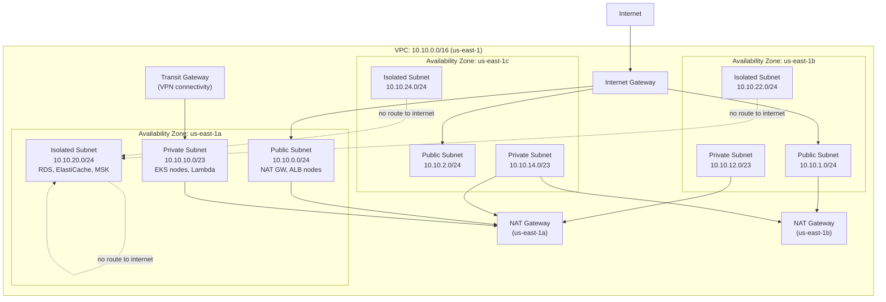

# Network Architecture

This document is the authoritative reference for Luminary's AWS network architecture. It is the primary document consulted during security reviews, compliance audits, and incident investigations involving network-layer issues.

**AWS Region**: `us-east-1` (primary), `eu-west-1` (secondary, analytics read replica only) **Last reviewed**: 2024-10-04 **Owner**: Infrastructure Team

---

## VPC Topology

Luminary uses a single VPC per region with three Availability Zones. Subnets are divided into three tiers with distinct routing and access control profiles:

### Subnet Routing Summary

| Subnet Tier | Internet Access | Route Table | Primary Resources |
| --- | --- | --- | --- |
| Public | Direct via IGW | `rtb-public` | ALB nodes, NAT Gateways, Bastion host |
| Private | Outbound via NAT Gateway | `rtb-private-{az}` | EKS worker nodes, Lambda functions, ClickHouse EC2 |
| Isolated | None | `rtb-isolated` | RDS, ElastiCache, MSK brokers, Vault |

Isolated subnets have **no default route**. Traffic between isolated resources and private-tier resources flows via the VPC router (intra-VPC routing). This ensures database and message broker resources cannot initiate or receive connections from outside the VPC under any circumstances.

---

## Security Groups

Security groups are the primary network access control mechanism. Each service tier has a dedicated security group; rules are expressed in terms of source/destination security group IDs, not CIDR ranges, wherever possible.

### sg-alb-external (Application Load Balancer)

Inbound rules — traffic from the internet:

| Rule | Protocol | Port | Source | Purpose |
| --- | --- | --- | --- | --- |
| HTTPS | TCP | 443 | 0.0.0.0/0, ::/0 | Customer and API traffic |
| HTTP | TCP | 80 | 0.0.0.0/0, ::/0 | Redirect to HTTPS only |

Outbound rules:

| Rule | Protocol | Port | Destination | Purpose |
| --- | --- | --- | --- | --- |
| HTTP | TCP | 8080 | `sg-eks-ingest` | Ingest API pods |
| HTTP | TCP | 8081 | `sg-eks-api` | REST API pods |
| HTTP | TCP | 8082 | `sg-eks-frontend` | Frontend SSR pods |

### sg-eks-ingest (Ingest API pods)

| Direction | Protocol | Port | Peer | Purpose |
| --- | --- | --- | --- | --- |
| Inbound | TCP | 8080 | `sg-alb-external` | HTTP from ALB |
| Inbound | TCP | 9090 | `sg-eks-monitoring` | Prometheus scrape |
| Outbound | TCP | 9092 | `sg-msk` | Kafka producer |
| Outbound | TCP | 6379 | `sg-elasticache` | Rate limit counters |
| Outbound | TCP | 443 | `sg-vpc-endpoints` | AWS API calls via VPC endpoint |

### sg-eks-api (API Service pods)

| Direction | Protocol | Port | Peer | Purpose |
| --- | --- | --- | --- | --- |
| Inbound | TCP | 8081 | `sg-alb-external` | HTTP from ALB |
| Inbound | TCP | 9090 | `sg-eks-monitoring` | Prometheus scrape |
| Outbound | TCP | 5432 | `sg-rds-postgres` | Postgres reads/writes |
| Outbound | TCP | 8123 | `sg-clickhouse` | ClickHouse HTTP interface |
| Outbound | TCP | 9000 | `sg-clickhouse` | ClickHouse native protocol |
| Outbound | TCP | 6379 | `sg-elasticache` | Query result caching |
| Outbound | TCP | 8200 | `sg-vault` | Vault secret reads |
| Outbound | TCP | 443 | `sg-vpc-endpoints` | AWS API calls |

### sg-eks-stream-processor (Kafka Streams pods)

| Direction | Protocol | Port | Peer | Purpose |
| --- | --- | --- | --- | --- |
| Inbound | TCP | 9090 | `sg-eks-monitoring` | Prometheus scrape |
| Outbound | TCP | 9092 | `sg-msk` | Kafka consumer + producer |
| Outbound | TCP | 8200 | `sg-vault` | Secret reads |
| Outbound | TCP | 5432 | `sg-rds-postgres` | Workspace config reads |

### sg-msk (MSK Kafka brokers)

| Direction | Protocol | Port | Peer | Purpose |
| --- | --- | --- | --- | --- |
| Inbound | TCP | 9092 | `sg-eks-ingest` | Ingest API producer |
| Inbound | TCP | 9092 | `sg-eks-stream-processor` | Stream processor consumer/producer |
| Inbound | TCP | 9092 | `sg-eks-api` | Direct consumer (billing, auth) |
| Inbound | TCP | 9094 | `sg-eks-stream-processor` | Kafka Streams (TLS port) |
| Inbound | TCP | 2181 | `sg-eks-stream-processor` | ZooKeeper (internal MSK use only) |
| Outbound | All | All | Self | Inter-broker replication |

### sg-rds-postgres (RDS instances)

| Direction | Protocol | Port | Peer | Purpose |
| --- | --- | --- | --- | --- |
| Inbound | TCP | 5432 | `sg-eks-api` | API service reads/writes |
| Inbound | TCP | 5432 | `sg-eks-stream-processor` | Config reads |
| Inbound | TCP | 5432 | `sg-eks-workers` | Background worker reads/writes |
| Inbound | TCP | 5432 | `sg-bastion` | Emergency direct access via bastion |
| Outbound | None | — | — | RDS is passive; no outbound rules |

### sg-clickhouse (ClickHouse EC2 nodes)

| Direction | Protocol | Port | Peer | Purpose |
| --- | --- | --- | --- | --- |
| Inbound | TCP | 8123 | `sg-eks-api` | HTTP interface |
| Inbound | TCP | 9000 | `sg-eks-api` | Native TCP protocol |
| Inbound | TCP | 9000 | `sg-eks-ch-writer` | ClickHouse writer pods |
| Inbound | TCP | 9363 | `sg-eks-monitoring` | Prometheus metrics exporter |
| Inbound | TCP | 9000 | Self | Inter-replica replication |
| Outbound | TCP | 2181 | `sg-eks-zookeeper` | ZooKeeper (replica coordination) |
| Outbound | HTTPS | 443 | S3 (VPC endpoint) | S3 tiered storage reads/writes |

### sg-elasticache (Redis cluster)

| Direction | Protocol | Port | Peer | Purpose |
| --- | --- | --- | --- | --- |
| Inbound | TCP | 6379 | `sg-eks-ingest` | Rate limiting |
| Inbound | TCP | 6379 | `sg-eks-api` | Query result cache, session tokens |
| Inbound | TCP | 6379 | `sg-eks-stream-processor` | Session state fast path |
| Outbound | None | — | — | ElastiCache is passive |

### sg-vault (HashiCorp Vault)

| Direction | Protocol | Port | Peer | Purpose |
| --- | --- | --- | --- | --- |
| Inbound | TCP | 8200 | `sg-eks-api` | Secret reads |
| Inbound | TCP | 8200 | `sg-eks-stream-processor` | Secret reads |
| Inbound | TCP | 8200 | `sg-eks-workers` | Secret reads |
| Inbound | TCP | 8200 | `sg-bastion` | Admin operations |
| Outbound | TCP | 5432 | `sg-rds-postgres` | Vault database backend |

---

## Network ACLs

NACLs provide a stateless, subnet-level defense-in-depth layer. They are intentionally minimal — primary access control is handled by security groups. NACLs focus on denying known-bad traffic classes that security groups cannot block (e.g., traffic within the same security group).

| NACL | Applies To | Key Rules |
| --- | --- | --- |
| `nacl-public` | Public subnets | Allow 443/80 inbound; deny RFC-1918 ranges inbound (prevents spoofed internal IPs); allow ephemeral ports outbound |
| `nacl-private` | Private subnets | Allow all intra-VPC traffic; allow outbound 443 to 0.0.0.0 (via NAT); deny direct inbound from 0.0.0.0 |
| `nacl-isolated` | Isolated subnets | Allow intra-VPC only on specific ports (5432, 6379, 9092, 9000, 8200); deny all else |

---

## NAT Gateways

Two NAT Gateways are deployed (one per AZ that has significant private-subnet workloads) for availability. Private subnets in `us-east-1a` and `us-east-1b` route through their local NAT Gateway. Private subnets in `us-east-1c` route through the `us-east-1b` NAT Gateway to reduce cross-AZ data transfer costs.

Monthly NAT Gateway data processed: ~18 TB (primarily S3 reads during ClickHouse cold tier reads and Lambda execution).

---

## VPC Endpoints (PrivateLink)

The following AWS services are accessed via VPC Interface Endpoints (PrivateLink) to avoid NAT Gateway costs and keep traffic within the AWS network:

| Service | Endpoint Type | Endpoint ID | Used By |
| --- | --- | --- | --- |
| S3 | Gateway | `vpce-s3-prod` | ClickHouse (tiered storage), batch jobs |
| ECR API | Interface | `vpce-ecr-api-prod` | EKS nodes pulling images |
| ECR DKR | Interface | `vpce-ecr-dkr-prod` | EKS nodes pulling images |
| Secrets Manager | Interface | `vpce-secretsmanager-prod` | Bootstrap secret fetch |
| SSM | Interface | `vpce-ssm-prod` | Parameter Store reads |
| CloudWatch Logs | Interface | `vpce-logs-prod` | All pods (log shipping without NAT) |
| SES | Interface | `vpce-ses-prod` | Notification service |
| STS | Interface | `vpce-sts-prod` | IRSA token exchange |

---

## WAF Configuration

AWS WAF (Web ACL `luminary-prod-waf`) is attached to the CloudFront distribution and the ALB. Rules are evaluated in order; the first matching rule terminates evaluation.

### WAF Rule Groups (in priority order)

| Priority | Rule | Action | Notes |
| --- | --- | --- | --- |
| 1 | `AWSManagedRulesAmazonIpReputationList` | Block | AWS-managed botnet and threat intel IP list |
| 2 | `AWSManagedRulesAnonymousIpList` | Count (monitor only) | Tor exit nodes, anonymous proxies — we don't block these as legitimate users may use VPNs |
| 3 | `AWSManagedRulesCommonRuleSet` | Block | OWASP Core Rule Set: SQLi, XSS, path traversal |
| 4 | `AWSManagedRulesKnownBadInputsRuleSet` | Block | Log4j, Spring4Shell, known exploit patterns |
| 5 | `rate-limit-ingest-api` | Block (429) | 10,000 req/5min per IP on `/v1/batch` and `/v1/track` |
| 6 | `rate-limit-auth-api` | Block (429) | 20 req/5min per IP on `/v1/auth/*` |
| 7 | `rate-limit-global` | Block (429) | 5,000 req/5min per IP global |
| 8 | `geo-block-sanctioned-countries` | Block | OFAC sanctioned countries (Cuba, Iran, North Korea, Syria, Crimea) |
| 9 | `size-restriction-ingest` | Block | Request body > 2 MB on ingest endpoints |

### WAF Logging

WAF logs are streamed to Kinesis Firehose → S3 (`s3://luminary-waf-logs/`) and also to CloudWatch Logs for real-time alerting. Logs are retained in S3 for 1 year.

A Datadog monitor fires when the WAF block rate exceeds 5,000 blocks/minute — this may indicate a DDoS attempt or a new bot campaign targeting ingest endpoints.

---

## CloudFront CDN Configuration

CloudFront is the entry point for all public traffic. The distribution (`E1LUMINARY2PROD`) is configured as follows:

| Setting | Value |
| --- | --- |
| Origins | ALB (API + ingest), S3 (static assets) |
| Price Class | PriceClass_All (global PoPs) |
| SSL Certificate | ACM wildcard `*.luminary.io` |
| TLS Minimum Version | TLSv1.2 |
| Security Policy | TLSv1.2_2021 (PFS required) |
| HTTP/2 | Enabled |
| Compression | Enabled (gzip, brotli) |
| WAF | `luminary-prod-waf` attached |

### Cache Behaviors

| Path Pattern | Cache TTL | Origin | Notes |
| --- | --- | --- | --- |
| `/v1/track`, `/v1/batch` | No cache (TTL 0) | ALB (ingest) | Ingest endpoints must not be cached |
| `/v1/auth/*` | No cache | ALB (API) | Auth state must not be cached |
| `/v1/api/*` | No cache | ALB (API) | API responses are dynamic |
| `/assets/*` | 1 year | S3 | Hashed filenames; immutable |
| `/static/*` | 24 hours | S3 |  |
| `/_health` | No cache | ALB (API) | Health check endpoint |
| `/*` (default) | 5 minutes | ALB (frontend) | SSR pages; short TTL for content freshness |

### Origin Shield

Origin Shield is enabled in `us-east-1` to reduce cache misses hitting the ALB. This adds one network hop for origin fetches but reduces ALB request volume by approximately 65% for cacheable content (primarily the frontend SSR pages).

---

## Bastion Host

A single bastion EC2 instance (`t3.micro`) in the public subnet of `us-east-1a` provides emergency direct access to private and isolated resources. The bastion is:

- Stopped when not in use (started via Systems Manager automation on demand)
- Accessible only via AWS Systems Manager Session Manager (no inbound SSH port open)
- Limited to members of the `engineering-ops` IAM group
- All session activity logged to CloudWatch Logs and S3

Direct SSH to the bastion is disabled. Port 22 is not open on `sg-bastion`. All access is via `aws ssm start-session`, which requires valid AWS credentials and SSO authentication.
