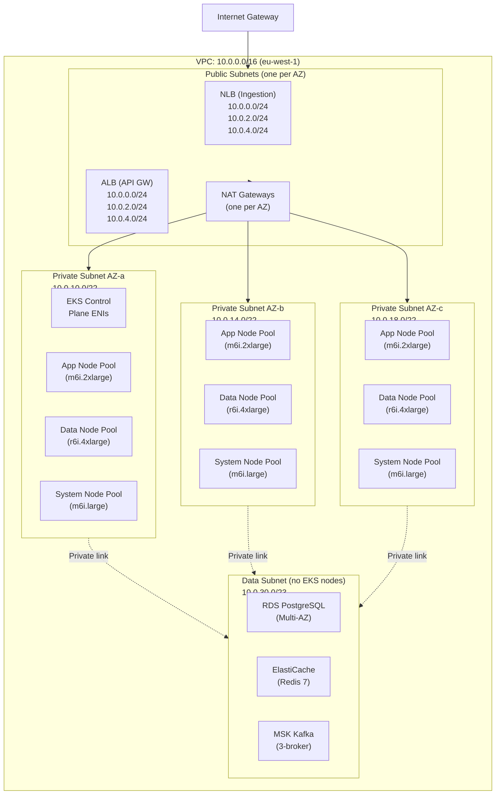

# Production Kubernetes Cluster Setup (EKS)

This page is the authoritative reference for the Luminary production EKS cluster configuration. It covers the cluster topology, node pool design, VPC and networking configuration, IAM setup, autoscaling, and all key add-ons.

The cluster is provisioned by the `luminary-eks` Terraform module — see [Terraform Modules](https://placeholder.invalid/page/infrastructure%2Fterraform-modules.md) for full module documentation. Day-to-day operational procedures (node drain, cluster upgrade, incident response) are in the [On-Call Guide](https://placeholder.invalid/page/operations%2Fon-call-guide.md).

---

## Cluster Architecture Overview



---

## Cluster Specification

| Property | Value |
| --- | --- |
| EKS Version | 1.30 |
| AWS Region | eu-west-1 |
| Availability Zones | eu-west-1a, eu-west-1b, eu-west-1c |
| Control Plane | AWS-managed (3 ENIs, one per AZ) |
| VPC CNI | Amazon VPC CNI v1.18 |
| CNI mode | `ENABLE_PREFIX_DELEGATION=true` (supports up to 110 pods/node on m6i.2xlarge) |
| DNS | CoreDNS 1.11.1 |
| kube-proxy | v1.30.1 |
| Networking plugin | No overlay; pods get VPC IPs directly |
| Private cluster | API server endpoint private; kubectl access via AWS SSO + `aws eks update-kubeconfig` |

---

## Node Pools

The cluster uses four node pools (Managed Node Groups), each with a distinct instance type and workload class, to allow independent autoscaling and to prevent noisy-neighbour interference between workload types.

| Node Pool | Instance Type | vCPU | RAM | Storage | Min | Max | Purpose |
| --- | --- | --- | --- | --- | --- | --- | --- |
| `system` | m6i.large | 2 | 8 GB | GP3 30 GB | 3 | 6 | CoreDNS, Karpenter controller, cert-manager, external-dns, cluster-autoscaler, Datadog agent |
| `app` | m6i.2xlarge | 8 | 32 GB | GP3 50 GB | 6 | 40 | Application services: Ingestion, Query, Auth, Permission, Billing |
| `data` | r6i.4xlarge | 16 | 128 GB | GP3 100 GB | 3 | 12 | Flink task managers, ClickHouse pods, Redis-backed enrichment cache |
| `clickhouse` | i3en.3xlarge | 12 | 96 GB | NVMe 7.5 TB | 6 | 6 | ClickHouse data nodes (fixed size; manually scaled) |

All node pools use **Amazon Linux 2023** as the base AMI, with a custom `bootstrap.sh` configuration to tune kernel parameters for network-intensive workloads (see below). AMI updates are applied via a rolling node group update, one AZ at a time, triggered by the `platform/cluster-upgrade` GitHub Actions workflow.

### Node Labels and Taints

Workload placement is controlled via node labels and taints. Each node pool has a corresponding label (`luminary.io/node-pool: <pool-name>`) and all pods use `nodeSelector` to land on the correct pool.

The `clickhouse` node pool has a dedicated taint:

```yaml
taints:
  - key: "luminary.io/node-pool"
    value: "clickhouse"
    effect: NoSchedule
```

Only ClickHouse `StatefulSet` pods have the corresponding toleration, preventing other workloads from accidentally consuming NVMe node capacity.

### Kernel Tuning (via EC2 userdata)

All node pools apply the following `sysctl` overrides at boot:

```shell
# /etc/sysctl.d/99-luminary.conf
# Increase socket buffer sizes for Kafka producer throughput
net.core.rmem_max = 67108864
net.core.wmem_max = 67108864
net.ipv4.tcp_rmem = 4096 87380 67108864
net.ipv4.tcp_wmem = 4096 65536 67108864

# Reduce TIME_WAIT bucket pressure from high connection rates
net.ipv4.tcp_tw_reuse = 1
net.ipv4.ip_local_port_range = 1024 65535

# VM tuning for ClickHouse write performance
vm.swappiness = 10
vm.dirty_ratio = 40
vm.dirty_background_ratio = 10
```

---

## IAM Configuration

### Cluster IAM Role

The EKS cluster itself uses a service-linked IAM role (`AmazonEKSClusterPolicy`) managed by EKS. No custom cluster IAM role is required.

### Node IAM Role

All node groups share a single node IAM role (`luminary-eks-node-role`) with the following managed policies:

- `AmazonEKSWorkerNodePolicy`
- `AmazonEKS_CNI_Policy`
- `AmazonEC2ContainerRegistryReadOnly`

Additional inline policies on the node role:

- `s3:GetObject` on `arn:aws:s3:::luminary-eks-bootstrap/*` (for custom AMI bootstrap scripts).
- `ec2:DescribeTags` (required by cluster-autoscaler).

### Pod-Level IAM (IRSA)

Individual pods that need AWS API access use **IAM Roles for Service Accounts (IRSA)**. The pattern is:

1. Create an IAM role with a trust policy scoped to the pod's Kubernetes service account.
2. Annotate the service account: `eks.amazonaws.com/role-arn: arn:aws:iam::...`.
3. The AWS SDK automatically assumes the role via the projected service account token.

Key IRSA roles:

| Service Account | Namespace | IAM Role | Permissions |
| --- | --- | --- | --- |
| `ingestion-service` | `production` | `luminary-ingestion-role` | MSK produce, Schema Registry read (via VPC endpoint) |
| `flink-jobmanager` | `flink` | `luminary-flink-role` | MSK consume, S3 read/write (checkpoints, archive) |
| `cluster-autoscaler` | `kube-system` | `luminary-ca-role` | EC2 AutoScaling describe/set, EC2 describe |
| `karpenter` | `karpenter` | `luminary-karpenter-role` | EC2 full lifecycle, IAM PassRole (for node role) |
| `external-dns` | `kube-system` | `luminary-external-dns-role` | Route 53 record create/update/delete in `luminaryapp.com` hosted zone |
| `cert-manager` | `cert-manager` | `luminary-certmgr-role` | Route 53 TXT record create/delete (DNS-01 ACME challenge) |
| `clickhouse-backup` | `clickhouse` | `luminary-ch-backup-role` | S3 read/write on `luminary-clickhouse-backups` bucket |

---

## Networking

### VPC Design

The VPC (`10.0.0.0/16`) is divided into three subnet tiers:

| Tier | CIDR range | Purpose |
| --- | --- | --- |
| Public | `10.0.0.0/22` (split across 3 AZs) | NLB, ALB, NAT Gateways |
| Private (EKS) | `10.0.10.0/20` (split across 3 AZs, /22 each) | EKS worker nodes and pods |
| Data | `10.0.30.0/23` | RDS, ElastiCache, MSK — no EKS nodes |

VPC Flow Logs are enabled to CloudWatch Logs with a 30-day retention, then exported to S3 for 1 year. Flow logs are used in security incident investigations.

### Security Groups

The cluster uses the **VPC CNI's security group per pod** feature for application pods that need direct access to RDS or MSK. For most pods, the node-level security group is sufficient.

Key security group rules:

```
# Node Security Group (luminary-eks-nodes-sg)
INBOUND:
  - Port 443 from luminary-eks-control-plane-sg (API server to kubelet)
  - Port 10250 from luminary-eks-control-plane-sg (kubelet API)
  - ALL from self (inter-node communication for pod networking)
  - Port 4190 from self (Istio ztunnel)

OUTBOUND:
  - ALL (nodes need to reach ECR, S3, MSK, RDS, etc.)

# Ingestion Service Pod Security Group (per-pod, via IRSA)
INBOUND:
  - Port 8080 from luminary-nlb-sg
OUTBOUND:
  - Port 9092 from luminary-msk-sg (Kafka produce)
  - Port 8081 from luminary-schema-registry-sg
```

### AWS Load Balancer Controller

The [AWS Load Balancer Controller](https://kubernetes-sigs.github.io/aws-load-balancer-controller/) manages ALB (for HTTP/HTTPS ingress via Kubernetes `Ingress` resources) and NLB (for the Ingestion Service's `Service` of type `LoadBalancer`).

Ingress class annotations in use:

```yaml
# ALB for API Gateway (HTTPS, WAF enabled)
annotations:
  kubernetes.io/ingress.class: alb
  alb.ingress.kubernetes.io/scheme: internet-facing
  alb.ingress.kubernetes.io/target-type: ip
  alb.ingress.kubernetes.io/certificate-arn: arn:aws:acm:eu-west-1:...:certificate/...
  alb.ingress.kubernetes.io/wafv2-acl-arn: arn:aws:wafv2:...
  alb.ingress.kubernetes.io/ssl-policy: ELBSecurityPolicy-TLS13-1-2-2021-06

# NLB for Ingestion Service (TCP, preserves client IP)
annotations:
  service.beta.kubernetes.io/aws-load-balancer-type: external
  service.beta.kubernetes.io/aws-load-balancer-nlb-target-type: ip
  service.beta.kubernetes.io/aws-load-balancer-scheme: internet-facing
  service.beta.kubernetes.io/aws-load-balancer-cross-zone-load-balancing-enabled: "true"
```

---

## Autoscaling

### Cluster Autoscaler

The [Cluster Autoscaler](https://github.com/kubernetes/autoscaler/tree/master/cluster-autoscaler) manages the `system`, `app`, and `data` node groups. It is **not** used for the `clickhouse` node group, which is fixed at 6 nodes.

Key Cluster Autoscaler configuration:

```yaml
# Helm values: charts/cluster-autoscaler/values-production.yaml
autoDiscovery:
  clusterName: luminary-production

extraArgs:
  balance-similar-node-groups: "true"
  skip-nodes-with-system-pods: "false"
  scale-down-delay-after-add: "5m"
  scale-down-unneeded-time: "10m"
  scale-down-utilization-threshold: "0.5"
  max-node-provision-time: "15m"
  # Prevent scale-down during business hours (07:00–20:00 UTC)
  # Handled via a separate scale-down lock mechanism, not CA config

resources:
  requests:
    cpu: 100m
    memory: 600Mi
```

### Karpenter (Burst Pool)

For workloads that need rapid scale-out beyond what Cluster Autoscaler can provide (e.g., a sudden ingestion spike), [Karpenter](https://karpenter.sh) manages a **burst node pool** of Spot `m6i` and `c6i` instances.

Karpenter `NodePool` resource:

```yaml
apiVersion: karpenter.sh/v1beta1
kind: NodePool
metadata:
  name: burst-spot
spec:
  template:
    metadata:
      labels:
        luminary.io/node-pool: burst
    spec:
      nodeClassRef:
        apiVersion: karpenter.k8s.aws/v1beta1
        kind: EC2NodeClass
        name: default
      requirements:
        - key: karpenter.sh/capacity-type
          operator: In
          values: ["spot"]
        - key: node.kubernetes.io/instance-type
          operator: In
          values: ["m6i.xlarge", "m6i.2xlarge", "c6i.xlarge", "c6i.2xlarge"]
        - key: topology.kubernetes.io/zone
          operator: In
          values: ["eu-west-1a", "eu-west-1b", "eu-west-1c"]
      kubelet:
        maxPods: 110
  limits:
    cpu: "160"      # ~20 × m6i.2xlarge
    memory: 640Gi
  disruption:
    consolidationPolicy: WhenUnderutilized
    consolidateAfter: 30s
```

Pods eligible for burst Spot nodes carry the label `luminary.io/spot-eligible: "true"` and toleration for the burst node pool taint. Currently only the Ingestion Service and batch-mode Query Service replicas carry this label.

### Horizontal Pod Autoscaler

Each application service has an HPA configured. Representative HPA for the Ingestion Service:

```yaml
apiVersion: autoscaling/v2
kind: HorizontalPodAutoscaler
metadata:
  name: ingestion-service
  namespace: production
spec:
  scaleTargetRef:
    apiVersion: apps/v1
    kind: Deployment
    name: ingestion-service
  minReplicas: 4
  maxReplicas: 40
  metrics:
    - type: Resource
      resource:
        name: cpu
        target:
          type: Utilization
          averageUtilization: 65
    - type: External
      external:
        metric:
          name: kafka_producer_queue_utilization
          selector:
            matchLabels:
              service: ingestion-service
        target:
          type: AverageValue
          averageValue: "70"   # percent
  behavior:
    scaleUp:
      stabilizationWindowSeconds: 30
      policies:
        - type: Pods
          value: 4
          periodSeconds: 60
    scaleDown:
      stabilizationWindowSeconds: 300
```

---

## Key Add-ons

### cert-manager

cert-manager v1.14 manages TLS certificates for all in-cluster HTTPS endpoints. Certificates are issued via **Let's Encrypt** (ACME DNS-01 challenge against Route 53) for public endpoints and via an internal **AWS Private CA** for internal service certificates.

```shell
# Check certificate status
kubectl get certificates -A
kubectl describe certificate luminary-api-tls -n production
```

### external-dns

external-dns v0.14 watches `Service` and `Ingress` resources and automatically creates/updates Route 53 records. It is scoped to the `luminaryapp.com` hosted zone.

Annotation required on resources to trigger DNS management:

```yaml
annotations:
  external-dns.alpha.kubernetes.io/hostname: api.luminaryapp.com
```

### AWS EBS CSI Driver

Used by ClickHouse `StatefulSet` for GP3 EBS volumes (WAL logs, temp storage). NVMe local SSDs are used for the primary ClickHouse data directory and are managed directly by the node's OS, not via Kubernetes persistent volumes.

Default StorageClass:

```yaml
apiVersion: storage.k8s.io/v1
kind: StorageClass
metadata:
  name: gp3-encrypted
  annotations:
    storageclass.kubernetes.io/is-default-class: "true"
provisioner: ebs.csi.aws.com
parameters:
  type: gp3
  iops: "3000"
  throughput: "125"
  encrypted: "true"
  kmsKeyId: arn:aws:kms:eu-west-1:...:key/...
volumeBindingMode: WaitForFirstConsumer
reclaimPolicy: Retain
```

### Datadog Agent (DaemonSet)

The Datadog Agent runs as a DaemonSet on all nodes. It collects:

- Container and host metrics (CPU, memory, disk I/O, network).
- Kubernetes state metrics via the `kube-state-metrics` sidecar.
- Application logs (structured JSON, forwarded to Datadog Log Management).
- APM traces (Datadog Agent acts as an OTLP receiver and forwards to Datadog APM).
- Network Performance Monitoring (eBPF-based, tracks per-pod connection metrics).

The Datadog Agent Helm chart is managed in `charts/datadog-agent/values-production.yaml` and pinned to a specific chart version. The `DD_API_KEY` is stored in AWS Secrets Manager and injected as a Kubernetes Secret by External Secrets Operator.

### Istio (Service Mesh)

See [ADR-003: Service Mesh Adoption](https://rgonek.atlassian.net/wiki/pages/viewpage.action?pageId=6389949) for the decision context. Istio is installed in ambient mode:

```shell
# Install Istio ambient mode
istioctl install --set profile=ambient \
  --set values.global.proxy.resources.requests.cpu=100m \
  --set values.global.proxy.resources.requests.memory=128Mi \
  -f istio-production-overrides.yaml

# Label namespace for ambient mesh
kubectl label namespace production istio.io/dataplane-mode=ambient
```

Key Istio resources are stored in `infra/istio/` in the `luminary/infra` repository and are applied via ArgoCD.

---

## Cluster Upgrade Procedure

EKS cluster upgrades follow a structured process to minimise risk:

1. **Check compatibility matrix:** Verify EKS 1.30→1.31 compatibility for all add-ons (Istio, Karpenter, cert-manager, etc.). Update the `infra/eks-compatibility.md` tracking sheet.
2. **Staging upgrade:** Apply the version bump to the staging cluster (`luminary-staging`) via Terraform. Monitor for 48 hours.
3. **Add-on pre-upgrade:** Update all managed add-ons (VPC CNI, CoreDNS, kube-proxy) to versions compatible with the target Kubernetes version, before upgrading the control plane.
4. **Control plane upgrade:** Apply `aws_eks_cluster` Terraform resource version change. EKS performs a rolling control plane upgrade; expect ~10 minutes of API server reduced availability (existing connections continue; new connections may fail).
5. **Data node group first:** Upgrade the `clickhouse` node group first (it is manually scaled and always has 6 nodes). Drain one node at a time: `kubectl drain --ignore-daemonsets --delete-emptydir-data <node>`.
6. **Rolling node group updates:** Use the Terraform `force_update_version = true` flag on each managed node group, one at a time. Cluster Autoscaler handles replacing nodes gracefully.
7. **Validation:** Run the full suite of smoke tests from the `platform/smoke-tests` workflow.

Full procedure: see the [On-Call Guide](https://placeholder.invalid/page/operations%2Fon-call-guide.md) for cluster operations runbooks.

---

## Related Pages

- [Terraform Modules](https://placeholder.invalid/page/infrastructure%2Fterraform-modules.md) — `luminary-eks` module documentation
- [CI/CD Pipeline](CI-CD-Pipeline-—-GitHub-Actions-and-ArgoCD.md) — How services are deployed onto this cluster
- [Architecture — System Overview](System-Architecture-—-Deep-Dive.md)
- [On-Call Guide](https://placeholder.invalid/page/operations%2Fon-call-guide.md) — Operational procedures
