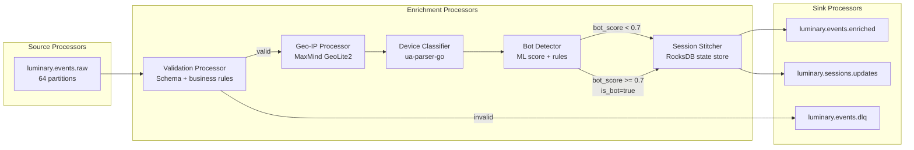

# Stream Processing

Luminary's event processing pipeline is built on **Kafka Streams 3.5**, running inside the `stream-processor` service. This document covers the topology design, performance characteristics, state store management, consumer lag monitoring, and how the pipeline handles late-arriving events.

> **Migration notice**: A migration from Kafka Streams to Apache Flink is planned and currently in the RFC phase. See [RFC-002 in the SD space](https://placeholder.invalid/page/..%2FSD%2Fdecisions%2Frfc-002-event-pipeline-rewrite.md) for the proposal. Until RFC-002 is approved and funded, Kafka Streams remains the production implementation documented here.

---

## Pipeline Overview



Each box in the enrichment section is a stateless or stateful processor node within the single Kafka Streams application. The topology is linear with a branch at validation (valid vs DLQ) and a secondary output at the Session Stitcher.

---

## Processor Details

### Validation Processor

**Type**: Stateless\
**Input**: `luminary.events.raw`\
**Outputs**: downstream chain (valid) | `luminary.events.dlq` (invalid)

Validates each event against:

1. **Avro schema conformance** — the raw payload is deserialized; malformed Avro fails immediately.
2. **Required fields** — `event_name` must be non-empty, <= 255 characters, and match `[a-zA-Z0-9_\s\-\.]+`.
3. **Workspace existence** — checked against an in-memory workspace ID set refreshed from Postgres every 60 seconds.
4. **Event name allowlist** — workspaces on free plans are limited to 100 distinct event names. Violations are routed to DLQ with code `EVENT_NAME_LIMIT_EXCEEDED`.
5. **Payload size** — properties map must not exceed 100 keys; individual string values truncated to 1,024 chars with a warning attached.

Events failing checks 1 or 2 are hard-rejected to DLQ. Events failing checks 3–5 are workspace-policy violations and generate a `POLICY_VIOLATION` DLQ entry; the underlying event is not forwarded.

### Geo-IP Processor

**Type**: Stateless (with embedded database)\
**Input**: validated event stream

Resolves `ip_address` to `(country_code, region, city, timezone)` using the MaxMind GeoLite2 City database embedded in the service image. The IP is not forwarded past this processor.

The GeoLite2 database is bundled at build time. A weekly CI job updates the database and bumps the image tag; the Argo Rollout handles zero-downtime replacement.

**P99 latency**: < 0.1ms per event (in-memory trie lookup)

### Device Classifier

**Type**: Stateless\
**Input**: geo-enriched event stream

Parses the `user_agent` string using `ua-parser-go` to populate `os_name`, `os_version`, `browser_name`, `browser_version`, and `device_type`. If the user agent is absent or unparseable, these fields are set to empty strings; no event is rejected.

### Bot Detector

**Type**: Stateless\
**Input**: device-classified event stream

Assigns a `bot_score` float (0.0–1.0) using a combination of:

- **Rule engine**: Known bot user-agent patterns, data center IP ranges (via AWS, GCP, Azure IP lists), headless browser fingerprints.
- **Heuristic model**: Simple logistic regression model trained on labeled bot sessions. Model weights are embedded in the service binary; refreshed via a quarterly model training job.

Events with `bot_score >= 0.7` have `is_bot = true` set but are **not dropped** — they continue through the pipeline and land in ClickHouse. The `is_bot` flag lets the query engine filter them at query time. This was a deliberate choice: discarding suspected bots at pipeline time made it impossible to audit the bot detection accuracy.

### Session Stitcher

**Type**: Stateful (RocksDB state store)\
**Input**: bot-scored event stream\
**Outputs**: enriched event stream + `luminary.sessions.updates`

The Session Stitcher assigns or extends session IDs using a 30-minute inactivity gap heuristic:

1. Look up the user's active session from the `session-store` RocksDB store keyed by `(workspace_id, anonymous_id)`.
2. If no active session exists, or the last event was > 30 minutes ago: create a new session ID, emit a `SessionUpdate{update_type: open}`.
3. If an active session exists and is within the window: assign the same session ID, update the session record, emit `SessionUpdate{update_type: extend}`.
4. On a configurable cleanup interval (default: every 500 events processed), scan for sessions idle > 35 minutes and emit `SessionUpdate{update_type: close}` for each.

The enriched event output carries the resolved `session_id` for all events after this processor.

---

## State Store Management

The Session Stitcher uses a single RocksDB-backed state store:

| Property | Value |
| --- | --- |
| Store name | `session-store` |
| Key | `{workspace_id}:{anonymous_id}` |
| Value | Protobuf-serialized `SessionState` |
| Estimated size | ~3 GB (per partition, 64 partitions total) |
| Total on-disk | ~192 GB across the stream processor fleet |
| Changelog topic | `stream-processor-session-store-changelog` |
| Changelog replication | 3 replicas, 7-day retention |

**State store recovery**: If a stream processor pod restarts, Kafka Streams restores the state store by replaying the changelog topic from the last committed offset. With 7-day retention this is safe for even extended outages. Typical recovery time from a clean pod restart is 4–8 minutes depending on changelog lag.

**State store pruning**: The `session-store` implements a custom `close()` callback that emits close events for any sessions still open when a partition is revoked (during rebalance). This prevents ghost sessions after partition reassignment.

### RocksDB Tuning

```properties
# stream-processor deployment env vars
ROCKSDB_BLOCK_CACHE_SIZE_MB=512
ROCKSDB_WRITE_BUFFER_SIZE_MB=64
ROCKSDB_MAX_WRITE_BUFFER_NUMBER=3
ROCKSDB_COMPRESSION=lz4
ROCKSDB_COMPACTION_STYLE=level
```

The default Kafka Streams RocksDB configuration was insufficient at our event volume — the write buffer was being flushed too frequently under peak load, causing noticeable GC pressure. The current settings were determined through load testing in staging.

---

## Application Configuration

```properties
# kafka-streams.properties (production)
application.id=stream-processor-prod
bootstrap.servers=kafka.luminary.internal:9092
security.protocol=SSL
ssl.truststore.location=/etc/kafka/truststore.jks
ssl.keystore.location=/etc/kafka/keystore.jks

# Processing
num.stream.threads=4
processing.guarantee=exactly_once_v2
commit.interval.ms=1000

# Consumer settings
fetch.min.bytes=65536
fetch.max.wait.ms=500
max.poll.records=2000

# Producer settings  
acks=all
enable.idempotence=true
compression.type=lz4
linger.ms=5
batch.size=131072

# State store
state.dir=/var/lib/kafka-streams/state
rocksdb.config.setter=com.luminary.streams.LuminaryRocksDBConfig
standby.replicas=1
```

### Exactly-Once Semantics

The pipeline runs with `processing.guarantee=exactly_once_v2` (EOS v2 / transaction-based). This means:

- Each output record is committed atomically with the input offset.
- Reprocessing after a crash does not produce duplicate enriched events or duplicate session updates.
- EOS has a throughput cost of approximately 15–20% compared to at-least-once at our batch sizes. This was deemed acceptable given the downstream impact of duplicate ClickHouse inserts (even with deduplication, they increase merge load).

---

## Consumer Lag Monitoring

Consumer lag for the stream processor is monitored via Datadog using the MSK integration. Key metrics:

| Metric | Alert threshold | P50 (normal load) | P99 (peak) |
| --- | --- | --- | --- |
| `kafka.consumer_group.lag` (events.raw → validated) | > 100,000 messages | ~800 | ~12,000 |
| `kafka.consumer_group.lag` (validated → enriched) | > 150,000 messages | ~1,200 | ~18,000 |
| `kafka.consumer_group.lag` (enriched → CH write) | > 500,000 messages | ~15,000 | ~85,000 |
| End-to-end pipeline latency (P99) | > 30 seconds | ~1.8 sec | ~8 sec |

The ClickHouse writer lag is intentionally higher — it batches writes for efficiency. Under normal operation the ClickHouse writer maintains a ~12-second write lag (it accumulates 10,000 events or 5 seconds, whichever comes first, before flushing a batch INSERT).

### Lag Runbook

If consumer lag exceeds alert thresholds:

1. Check the stream processor pod count: `kubectl get pods -n data-pipeline -l app=stream-processor`
2. Check for processing errors in pod logs: `kubectl logs -n data-pipeline -l app=stream-processor --tail=200 | grep ERROR`
3. If pods are healthy but lag is growing, scale up: `kubectl scale deployment stream-processor -n data-pipeline --replicas=N`

   - Note: Cannot exceed the partition count (64) — adding more pods than partitions has no effect.
4. If lag is in the ClickHouse writer specifically, check ClickHouse cluster health first before scaling.

---

## Handling Late-Arriving Events

Late events (where `client_ts` lags significantly behind `received_at`) are handled by the pipeline with the following strategy:

**Definition of "late"**: An event where `received_at - client_ts > 2 hours`.

| Lateness | Handling |
| --- | --- |
| 0 – 2 hours | Normal processing; `client_ts` is accepted as-is |
| 2 – 24 hours | Accepted; tagged with `validation_warning: late_event`. Session stitching uses `received_at` for session assignment, not `client_ts`. |
| 24 hours – 7 days | Accepted; tagged with `validation_warning: very_late_event`. ClickHouse partition is assigned based on `received_at` (not `client_ts`). |
| > 7 days | Rejected to DLQ with code `CLIENT_TS_TOO_OLD`. The 7-day limit prevents inserting into already-expired partitions. |

**Why use** `received_at` **for partitioning instead of** `client_ts`**?**\
If we partitioned by `client_ts`, a batch of mobile events that queued offline and arrived 3 days late would land in a partition that ClickHouse may have already moved to cold storage. Reads against cold-tier parts are significantly slower, and we'd be mixing current-day hot data with old cold data in the same partition — defeating the tiering strategy. Using `received_at` for the partition key keeps write performance predictable. Downstream, the query engine allows customers to query by either `client_ts` or `received_at` and handles the time-axis discrepancy via a configurable `timestamp_mode` query parameter.

---

## Performance Characteristics

| Metric | Value |
| --- | --- |
| Sustained throughput | ~17,500 events/sec |
| Peak burst throughput | ~35,000 events/sec (tested in staging load tests) |
| P50 end-to-end latency | ~1.8 seconds |
| P99 end-to-end latency | ~8 seconds (peak load) |
| Pod count (production) | 8 pods, 4 Kafka Streams threads each = 32 parallel processing threads |
| CPU per pod | 2 vCPU request, 4 vCPU limit |
| Memory per pod | 6 GiB request, 8 GiB limit (dominated by RocksDB block cache) |

The current architecture has a practical ceiling of approximately 55,000 events/sec before requiring either partition count increases or horizontal scaling beyond 64 pods. Given the planned Flink migration (RFC-002), we are not investing in further Kafka Streams scaling capacity.
