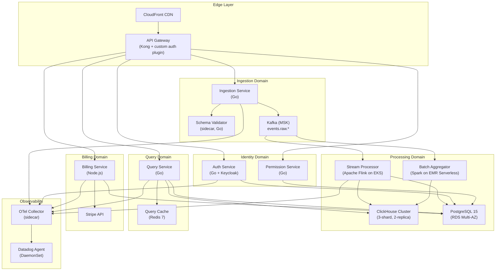

# System Architecture — Deep Dive

This page is the authoritative reference for the Luminary platform's internal service topology. It covers the purpose and responsibility of every production service, the technology choices behind each one, inter-service communication patterns, and the design principles that govern how we evolve the system.

For the high-level context diagram showing Luminary's relationship with external actors, see the [Architecture Index](https://rgonek.atlassian.net/wiki/pages/viewpage.action?pageId=6389968). For the detailed data flow through the ingestion pipeline, see [Data Flow](Data-Flow-—-Event-Ingestion-to-Storage.md).

---

## Architecture Philosophy

Luminary is built as a purpose-driven set of microservices rather than a generic service mesh. We do not decompose for the sake of decomposition — each service boundary maps to a distinct operational domain with its own scaling profile, team ownership, and data store.

The system is designed around three core principles that sometimes create tension with each other:

**Fast reads, durable writes.** The ingestion path is optimised for throughput and durability. Kafka provides the durable buffer; we do not acknowledge an event to the client until it is committed to a Kafka partition. The read path (query service + ClickHouse) is optimised for latency and concurrency — we pre-aggregate where possible and use materialised views to keep hot queries fast.

**Explicit contracts between services.** Services communicate via versioned Avro schemas on Kafka topics for async flows, and via gRPC with protobuf IDL for synchronous calls. No service reads another service's database directly. Schema changes go through the [schema registry compatibility gate](ADR-002-Event-Schema-Versioning-with-Avro-and-Schema-Registry.md) before merging.

**Blast radius minimisation.** A failure in the billing service must not degrade query performance. A spike in ingestion volume must not starve the query service of CPU. We achieve this through separate node pools on Kubernetes, independent HPA policies, and circuit breakers on all synchronous inter-service calls.

---

## Component Diagram

---

## Service Catalogue

### Ingestion Service

**Role:** The front door for all event data. Accepts batched events from customer SDKs over HTTPS, validates them against the registered Avro schema for the workspace's event stream, and publishes them to Kafka.

**Technology:** Go 1.22. Deployed as a Kubernetes `Deployment` with HPA (min 4, max 40 replicas). Exposed behind an NLB (Layer 4) for lowest possible connection overhead.

**Key behaviours:**

- Authenticates requests using a workspace API key, resolved to a `workspace_id` via a local in-memory cache (refreshed every 30 seconds from Auth Service).
- Validates each event batch against the schema registry before publishing. Invalid events are rejected with a `422` and the offending field path returned to the caller.
- Implements backpressure: if the Kafka producer queue exceeds 80% capacity, the service returns `429 Too Many Requests` with a `Retry-After` header. Events are never silently dropped.
- Emits per-workspace event counts to a high-cardinality Kafka topic (`events.billing.usage`) consumed by the Billing Service.

**SLA:** 99.9% availability; p99 write latency < 50 ms at steady state; p99 write latency < 200 ms under 3× peak load.

---

### Schema Validator (sidecar)

**Role:** Co-located with the Ingestion Service as an Envoy-style sidecar. Fetches and caches Avro schemas from the Confluent Schema Registry and provides a fast local validation path so the ingestion service avoids a network call on the hot path.

**Technology:** Go 1.22. Schemas are cached in-process with a 60-second TTL. Cache misses trigger a synchronous fetch from the registry; validation is blocked during the first fetch for a new schema ID.

---

### Stream Processor (Flink)

**Role:** Consumes from `events.raw.*` Kafka topics, performs stateful windowed aggregations (session windows, tumbling 1-minute windows), and writes materialised metrics rows into ClickHouse. Also enriches events with user properties fetched from a Redis-backed property store.

**Technology:** Apache Flink 1.18, deployed on Kubernetes via the Flink Kubernetes Operator. Jobs are managed as `FlinkDeployment` custom resources. State backend is RocksDB, checkpointed to S3 every 60 seconds.

**Key behaviours:**

- Session windows are keyed on `(workspace_id, anonymous_id)` with a 30-minute session gap.
- Enrichment fetches are batched (up to 500 per request) and served from Redis. Cold misses fall back to PostgreSQL.
- Exactly-once semantics are enabled via Flink's two-phase commit sink to Kafka and idempotent ClickHouse inserts.
- Late events (> 10 minutes behind watermark) are routed to `events.late.*` topics for async reprocessing by the Batch Aggregator.

**SLA:** End-to-end event-to-ClickHouse latency p99 < 30 seconds; checkpoint failure rate < 0.1% per day.

---

### Batch Aggregator (Spark)

**Role:** Nightly full-recompute job that reprocesses the previous 7 days of raw events from Kafka compacted topics (or S3 archive for data older than 7 days) and overwrites ClickHouse partition data to correct for late arrivals and schema migrations.

**Technology:** Apache Spark 3.5 on EMR Serverless. Triggered by an EventBridge rule at 02:00 UTC. Outputs written to ClickHouse via the `clickhouse-spark-connector`.

**SLA:** Full 7-day recompute completes within 4 hours; failure triggers PagerDuty P2.

---

### Query Service

**Role:** Executes ad-hoc and dashboard queries on behalf of authenticated users. Accepts a high-level query DSL (JSON over REST), translates it to optimised ClickHouse SQL, and returns results. Also handles pre-computed metric reads from PostgreSQL.

**Technology:** Go 1.22. Uses a connection pool to ClickHouse (max 50 connections per pod). Query results are cached in Redis with a TTL derived from the query's time range (recent windows get shorter TTLs).

**Key behaviours:**

- All queries are transparently scoped to `workspace_id` — the service appends a mandatory `WHERE workspace_id = ?` predicate. This is enforced at the query builder layer, not left to callers.
- Queries with a `time_range > 90 days` are routed to a dedicated "heavy query" ClickHouse shard to avoid impacting real-time dashboard users.
- Query execution budget: 30-second hard timeout. Queries that exceed this return a `408` with a suggestion to narrow the time window.
- A query plan cache avoids re-parsing the DSL for repeated identical queries within a session.

**SLA:** 99.9% availability; p95 query latency < 500 ms for pre-aggregated metrics; p95 < 5 seconds for ad-hoc ClickHouse queries.

---

### Auth Service

**Role:** Issues and validates JWTs for human users (SSO via SAML/OIDC), and manages API key lifecycle for programmatic access. Integrates with Keycloak as the identity provider backend.

**Technology:** Go 1.22 service fronting Keycloak 23. JWTs are signed with RS256; public keys are served at a JWKS endpoint polled by the API Gateway every 5 minutes. API keys are stored as bcrypt hashes in PostgreSQL.

**Key behaviours:**

- Supports Google Workspace SSO and generic SAML 2.0 for enterprise customers.
- API keys carry an embedded `workspace_id` claim and a `scopes` list. The Permission Service enforces scope checks.
- Token refresh is handled transparently by the dashboard SPA; background token refresh fires at 80% of token lifetime.
- Brute-force protection: 5 failed API key lookups from the same IP within 60 seconds triggers a 15-minute block.

**SLA:** 99.95% availability; token validation p99 < 10 ms (served from API Gateway cache after first request).

---

### Permission Service

**Role:** Fine-grained RBAC enforcement. Answers the question: "Can user `U` perform action `A` on resource `R` in workspace `W`?"

**Technology:** Go 1.22. Permission rules are stored in PostgreSQL and loaded into an in-process OPA (Open Policy Agent) engine at startup, refreshed every 30 seconds. OPA policy bundles are stored in S3.

**Built-in roles:** `Owner`, `Admin`, `Editor`, `Viewer`. Custom roles are a Pro tier feature.

**SLA:** p99 decision latency < 5 ms (local OPA evaluation, no network call on hot path).

---

### Billing Service

**Role:** Tracks event ingestion volume and seat counts per workspace. Reconciles usage against plan limits. Syncs subscription state with Stripe. Triggers overage notifications and enforces ingestion hard caps.

**Technology:** Node.js 20 (TypeScript). Chosen for its rich Stripe SDK ecosystem. Runs as a low-replica (2–4 pods) service since it is not on the hot path.

**Key behaviours:**

- Consumes `events.billing.usage` Kafka topic to accumulate event counts in Redis, flushed to PostgreSQL every 5 minutes.
- Ingestion hard cap: when a workspace exceeds 110% of its monthly event quota, the Ingestion Service is signalled (via a flag in Redis) to start rejecting requests with `402 Payment Required`.
- Monthly usage reports are generated by a scheduled job and sent via the Notification Service (email).
- Stripe webhooks are verified by signature; idempotency keys prevent double-processing replays.

**SLA:** 99.5% availability (non-critical path); Stripe sync lag < 1 minute.

---

## Service Catalogue Summary Table

| Service | Language | Replicas (steady) | Data Store(s) | Owner Team | SLA Availability | SLA Latency |
| --- | --- | --- | --- | --- | --- | --- |
| Ingestion Service | Go 1.22 | 8 | Kafka (write-only) | Platform Eng | 99.9% | p99 < 50 ms |
| Schema Validator | Go 1.22 | co-located | Schema Registry (read) | Platform Eng | N/A (sidecar) | < 1 ms local |
| Stream Processor | Flink 1.18 | 6 task managers | ClickHouse, Redis, S3 | Data Eng | 99.9% | e2e p99 < 30 s |
| Batch Aggregator | Spark 3.5 | ephemeral (EMR) | ClickHouse, S3 | Data Eng | N/A (batch) | < 4 h nightly |
| Query Service | Go 1.22 | 6 | ClickHouse, PostgreSQL, Redis | Platform Eng | 99.9% | p95 < 500 ms |
| Auth Service | Go 1.22 + Keycloak | 3 (Go) + 2 (KC) | PostgreSQL | Identity Eng | 99.95% | p99 < 10 ms |
| Permission Service | Go 1.22 | 3 | PostgreSQL, OPA in-process | Identity Eng | 99.9% | p99 < 5 ms |
| Billing Service | Node.js 20 (TS) | 3 | PostgreSQL, Redis, Stripe | Growth Eng | 99.5% | N/A (async) |

---

## Inter-Service Communication

### Synchronous (gRPC)

Services that require low-latency request/response interactions use gRPC with mutual TLS enforced by the Istio service mesh. The canonical gRPC calls in the system are:

- `APIGateway → AuthService`: `ValidateToken(token) → TokenClaims`
- `APIGateway → PermissionService`: `CheckPermission(user, action, resource) → Allow/Deny`
- `IngestionService → SchemaValidator`: `ValidateBatch(events, schema_id) → ValidationResult` (loopback, no network)

All gRPC clients implement exponential backoff with jitter (initial 50 ms, max 2 s, factor 2, jitter ±20%). Circuit breakers (Hystrix-pattern via Istio `DestinationRule`) open after 5 consecutive failures and half-open after 10 seconds.

### Asynchronous (Kafka)

All high-throughput data flows use Kafka. Topic naming convention: `events.<domain>.<descriptor>`. Key Kafka topics:

| Topic | Producers | Consumers | Purpose |
| --- | --- | --- | --- |
| `events.raw.{workspace_id}` | Ingestion Service | Stream Processor, Batch Aggregator | Raw validated events |
| `events.billing.usage` | Ingestion Service | Billing Service | Per-workspace event count increments |
| `events.late.{workspace_id}` | Stream Processor | Batch Aggregator | Events that missed the Flink watermark |
| `events.dlq` | All services | Platform Eng (manual) | Unprocessable events for investigation |

For the full topic schema documentation and retention configuration, see [Data Flow](Data-Flow-—-Event-Ingestion-to-Storage.md#kafka-topics).

---

## Database Ownership

Each database is owned by exactly one logical service domain. No cross-domain DB reads. Shared data is exposed via service API or Kafka.

| Database | Engine | Owner Service | Primary Use |
| --- | --- | --- | --- |
| `luminary_platform` | PostgreSQL 15 (RDS) | Auth, Permission, Billing | User accounts, workspaces, permissions, billing records |
| `luminary_analytics` | ClickHouse (self-hosted) | Stream Processor, Query Service | Aggregated metrics, event counts, funnel data |
| `luminary_cache` | Redis 7 (ElastiCache) | Query Service, Billing, Stream Processor | Query result cache, usage counters, enrichment data |

---

## Failure Modes and Mitigations

| Failure | Impact | Mitigation |
| --- | --- | --- |
| Kafka partition leader election | Ingestion paused up to 30 s | Client SDK retry with exponential backoff; MSK multi-AZ |
| ClickHouse shard unavailable | Heavy queries fail; pre-agg reads unaffected | Query Service falls back to pre-agg PostgreSQL for affected metrics |
| Redis unavailable | Query cache miss; billing counter loss | Query Service degrades to direct CH queries; billing reconciles from Kafka on restart |
| Flink checkpoint failure | Risk of event reprocessing on recovery | Exactly-once semantics; idempotent ClickHouse inserts prevent duplicates |
| Schema Registry unavailable | Ingestion Service rejects all events | Schema Validator uses a 60-second local cache; brief outage is transparent |
| Auth Service unavailable | All authenticated API calls fail | API Gateway caches validated tokens for their remaining TTL (up to 15 min) |

---

## Deployment and Versioning

All services are deployed via ArgoCD from GitOps repositories. Each service has its own Helm chart under `charts/<service-name>/`. Image tags follow semantic versioning (`MAJOR.MINOR.PATCH`) and are pinned in the ArgoCD `Application` manifest — no floating tags in production.

See the [CI/CD Pipeline](https://placeholder.invalid/page/infrastructure%2Fci-cd-pipeline.md) page for the full pipeline description including rollback procedures.

---

## Related Pages

- [Data Flow](Data-Flow-—-Event-Ingestion-to-Storage.md) — Detailed event ingest sequence diagrams
- [ADR-001: ClickHouse Adoption](https://rgonek.atlassian.net/wiki/pages/viewpage.action?pageId=5341327)
- [ADR-002: Event Schema Versioning](ADR-002-Event-Schema-Versioning-with-Avro-and-Schema-Registry.md)
- [ADR-003: Service Mesh Adoption](https://rgonek.atlassian.net/wiki/pages/viewpage.action?pageId=6389949)
- [Kubernetes Cluster Setup](https://placeholder.invalid/page/infrastructure%2Fkubernetes-cluster-setup.md)
- [Processes](https://placeholder.invalid/page/..%2FSD%2Fprocesses%2Fengineering-process.md) — Operational procedures and engineering processes
