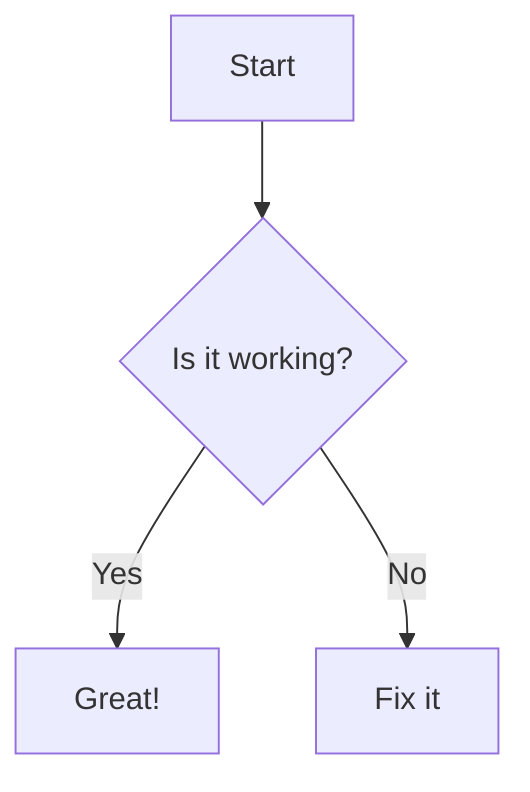
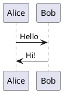

# Opencode Simple Test

This is a simple test page.

## Mermaid Diagram

```mermaid
graph TD
    A[Start] --> B{Is it working?}
    B -- Yes --> C[Great!]
    B -- No --> D[Fix it]
```

## PlantUML Diagram

```plantuml
@startuml
Alice -> Bob: Hello
Bob -> Alice: Hi!
@enduml
```

## Attachment Test
[Test Attachment](./assets/4161537/test-attachment.txt)

