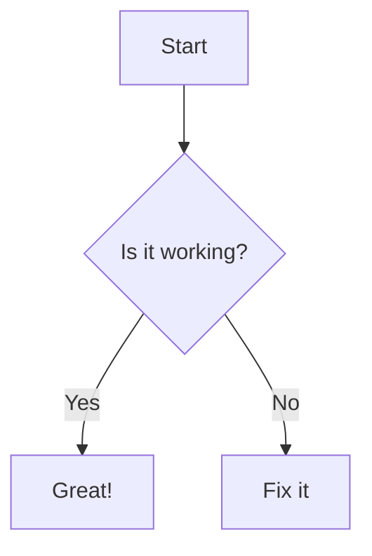
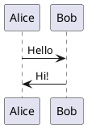

# Opencode Simple Test - Local Change

This is a local change.

## Mermaid Diagram

```mermaid
graph TD
    A[Start] --> B{Is it working?}
    B -- Yes --> C[Great!]
    B -- No --> D[Fix it]
```

## PlantUML Diagram

```plantuml
@startuml
Alice -> Bob: Hello
Bob -> Alice: Hi!
@enduml
```

## Attachment Test

Removed attachment.
