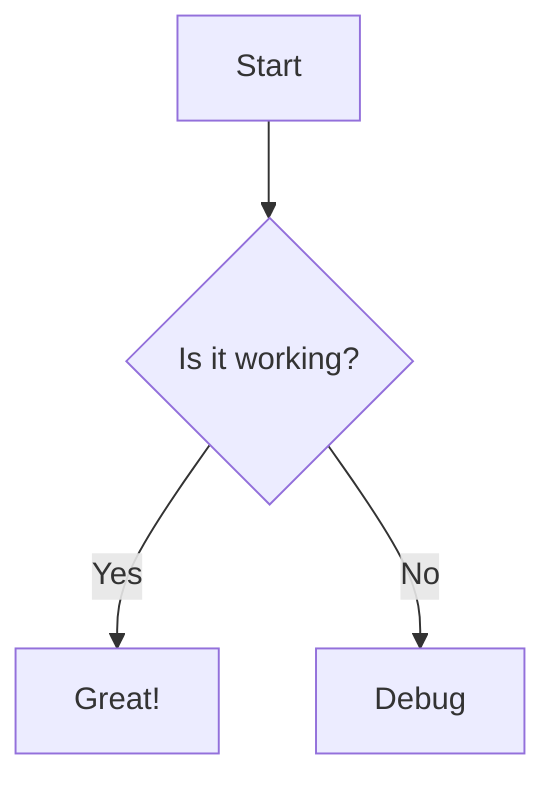
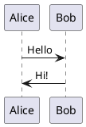

# Test Extensions

## Mermaid

```mermaid
graph TD
    A[Start] --> B{Is it working?}
    B -- Yes --> C[Great!]
    B -- No --> D[Debug]
```

## PlantUML

```plantuml
@startuml
Alice -> Bob: Hello
Bob -> Alice: Hi!
@enduml
```
